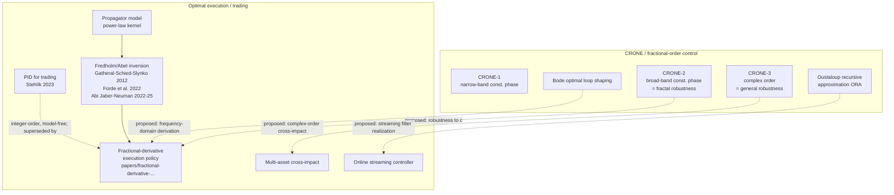

# CRONE control literature → insights and new results for optimal trading

**Date:** 2026-06-27
**Slug:** `crone-control-optimal-trading`
**Companion:** `outputs/fractional-kernels-optimal-execution.md`, `papers/fractional-derivative-optimal-execution.md`

---

## 1. TL;DR

CRONE control (Oustaloup, 1981–) is the engineering discipline that
designs *frequency-domain robust controllers using fractional-order
open-loop transfer functions*. The three generations escalate from a
narrow-band constant-phase controller (CRONE-1) to a broad-band
constant-phase template (CRONE-2) to a complex-order generalized
template that is robust against arbitrary plant uncertainty (CRONE-3).
The core CRONE theorem — *"the damping ratio of the closed-loop step
response depends only on the non-integer order of the open-loop
fractional integrator, not on its gain"* (Oustaloup, *From fractal
robustness to the CRONE approach*, 1998) — is the engineering analogue
of a robustness statement that the optimal-execution literature has not
yet formulated for propagator models with mis-specified impact
strength.

Two findings stand out:

1. **We found no paper in this review that applies CRONE methodology to optimal trading or optimal execution.**
   The closest finance work is (a) PID-based trading (integer-order;
   model-free; Stehlík et al. 2023), (b) fractional Brownian /
   rough-volatility *modelling* (fractional drivers but not fractional
   controllers), and (c) fractional sliding-mode control of *chaotic
   financial-dynamics toy models* (Dadras & Momeni 2010, Tacha et al.
   2023). Plain CRONE methodology — fractional open-loop shaping in
   the frequency domain to gain explicit robustness to plant
   uncertainty — has not been transferred to execution control or
   market making.

2. **The transferable insights are concrete.** CRONE delivers a
   ready-made package of (i) frequency-domain robustness theorems for
   fractional integrators, (ii) the Oustaloup recursive approximation
   (ORA) for fast, finite-order realization of $s^\alpha$, and (iii) an
   industrial toolbox (CRONE Toolbox for MATLAB) that already
   discretizes and tunes fractional-order controllers. Each of these
   transfers directly to the fractional-derivative-of-signal execution
   policy derived from power-law propagator impact.

---

## 2. CRONE control: what it actually is

### 2.1 The fractal-robustness theorem

Oustaloup's foundational observation (developed across the 1980s,
first consolidated in the book *La commande CRONE* (Hermès, 1991), and
surveyed in *From fractal robustness to the CRONE approach*, ESAIM
Proc. 5, 1998,
https://www.esaim-proc.org/articles/proc/pdf/1998/03/proc-Vol5.15.pdf)
is that the linear non-integer-order differential equation governing a
canonical fractional integrator has a damping ratio that depends only
on the non-integer order $n$ and **not** on the natural frequency
$\omega_u$ (the unit-gain crossover frequency). The closed-loop step
response therefore preserves its damping under arbitrary scaling of
$\omega_u$ — the engineering definition of "fractal robustness."

In CRONE language the open-loop transfer function is designed as

$$ \beta(s) \;=\; \left(\frac{\omega_u}{s}\right)^{n}, \qquad n \in (1,2), $$

so that the Nichols-plane locus is a *vertical line segment* (a "vertical
template"). Plant gain variations slide this template up and down on
itself, leaving phase margin — and therefore damping — invariant.

### 2.2 The three generations

The three generations differ in *which* class of plant uncertainty the
fractional shape robustifies against (Sabatier, Lanusse, Melchior,
Oustaloup, *CRONE control: principles, extensions and applications*,
J. Appl. Nonlinear Dyn. 2(2), 2013,
https://doi.org/10.5890/jand.2013.08.001; Lanusse, Sabatier, Nelson
Gruel, Oustaloup, *Second and third generation CRONE control*,
https://portal.mardi4nfdi.de/wiki/Second_and_third_generation_CRONE_control-system_design):

| Generation | Open-loop template | Robust to | Tuning knob |
|---|---|---|---|
| CRONE-1 | Fractional-order controller $C(s)\propto (s/\omega_{cg})^n$ used where the plant phase is approximately constant around $\omega_{cg}$ | Plant gain variations within the constant-phase band | Order $n$ and $\omega_{cg}$ |
| CRONE-2 | Vertical template (constant phase) over a broad band $[\omega_l,\omega_h]$ | Pure gain variations | Real order $n \in (1,2)$ |
| CRONE-3 | Generalized template = straight line of any direction in Nichols plane | Any structured plant uncertainty | *Complex* order $n = a+ib$ |

CRONE-3 is the one that uses the *complex non-integer derivation*
$s^{a+ib}$, which produces a Nichols-plane segment of arbitrary slope
and gives the designer one more degree of freedom against
non-gain-only plant uncertainty (Oustaloup–Mathieu, 1993,
https://doi.org/10.1109/icsmc.1993.384864).

### 2.3 Implementation: Oustaloup recursive approximation (ORA)

For computation, $s^\alpha$ is replaced by a finite-order rational
approximation valid on a frequency band $[\omega_l,\omega_h]$:

$$ s^\alpha \;\approx\; K\,\prod_{n=1}^{N}\frac{1+s/\omega_{z,n}}{1+s/\omega_{p,n}}, \qquad \omega_{z,n},\omega_{p,n}\;\text{geometric in}\;[\omega_l,\omega_h]. $$

This is the Oustaloup recursive approximation
(Oustaloup, Levron, Mathieu, Nanot, *Frequency-band complex noninteger
differentiator*, IEEE TCAS-I 47(1), 2000). MATLAB implementations and
variants are widespread (MATLAB Central #3802,
https://www.mathworks.com/matlabcentral/fileexchange/3802; survey of
variants:
https://www.mdpi.com/2073-8994/12/11/1898). The CRONE Toolbox
(Lanusse, Malti, Melchior, *CRONE control system design toolbox*,
Phil. Trans. R. Soc. A, 2013) packages the full design flow.

### 2.4 Stability/tuning theorems relevant downstream

- *Bode optimal loop shaping with CRONE compensators*
  (Lanusse–Oustaloup–Sabatier–Mathieu, J. Vib. Control 17(2), 2011,
  https://journals.sagepub.com/doi/10.1177/1077546310388002): explicit
  CRONE designs that realize Bode's eight-parameter ideal loop, giving
  optimal robustness/performance trade-offs.
- *Tuning guidelines for fractional-order PID controllers: Rules of
  thumb* (Tepljakov et al., ISA Trans., 2018,
  https://www.sciencedirect.com/science/article/pii/S0957415818301612):
  practical tuning recipes from the wider FOPID literature compatible
  with CRONE.
- *Robust FOPID controller design for fractional-order delay systems*
  (Wang et al., Int. J. Robust Nonlin. Control, 2019,
  https://onlinelibrary.wiley.com/doi/10.1002/rnc.4667): explicit
  positive-stability-region tuning when the plant is itself
  fractional-order — the closest engineering analogue of a fractional
  *propagator* plant.

---

## 3. Finance / trading literature that touches fractional control

### 3.1 PID for algorithmic trading (integer-order)

Stehlík, Sabolová, Pukseva, *On a Data-Driven Optimization Approach to
the PID-Based Algorithmic Trading*, J. Risk Financial Manag. 16(9),
2023, https://doi.org/10.3390/jrfm16090387 and the corresponding
Quant.SE thread
https://quant.stackexchange.com/questions/41218/has-work-been-done-on-pid-controllers-for-optimal-trading.

- Uses *integer-order* PID, model-free, with optimization-based tuning
  on historical price data.
- Does **not** invoke fractional calculus, propagator models, or
  CRONE-style robustness arguments.
- The Quant.SE answers explicitly point to Cartea–Jaimungal as the
  stochastic-control alternative to PID in trading.

This paper is the closest "control-engineering-for-trading" reference
and it is two steps behind a CRONE-style approach: it picks PID rather
than fractional-PID and tunes empirically rather than from a
robustness argument.

### 3.2 Fractional Brownian / rough-volatility *modelling*

These papers use fractional Brownian motion or rough volatility on the
**plant** side, not on the controller side:

- Hu, Øksendal, *Fractional white noise calculus and applications to
  finance*, 2003, https://scispace.com/papers/fractional-white-noise-calculus-and-applications-to-finance-28346hhrob.
- Han, Pun, Wong, *Portfolio Optimization under Fast Mean-Reverting and
  Rough Fractional Stochastic Environment*, Appl. Math. Finance, 2019,
  https://doi.org/10.1080/1350486x.2019.1584532.
- Bäuerle, Desmettre, *Portfolio Optimization in Fractional and Rough
  Heston Models*, arXiv:1809.10716,
  https://ar5iv.labs.arxiv.org/html/1809.10716.
- Sun, Aljarrah, *Applications of fractional stochastic volatility
  models to market microstructure theory and optimal execution
  strategies*, Front. Appl. Math. Stat., 2024,
  https://doi.org/10.3389/fams.2024.1456746.

These are essential context for the *data-generating* side but do not
contain any controller-side fractional design.

### 3.3 Fractional control of "financial-system" toy models

A small literature uses fractional-order sliding-mode / chaos
suppression on synthetic financial-dynamics ODEs:

- Dadras, Momeni, *Control of a fractional-order economical system via
  sliding mode*, Physica A 389(12), 2010,
  https://www.sciencedirect.com/science/article/abs/pii/S0378437110001524.
- Tacha et al., *Dynamic Analysis and Control of a Financial System
  with Chaotic Behavior Including Fractional Order*, Fractal Fract.
  7(7), 2023, https://www.mdpi.com/2504-3110/7/7/535.

These apply fractional control machinery but to abstract economic
ODE systems with no link to trading, execution, or market
microstructure. They are method-transfers, not finance results.

### 3.4 Stochastic-fractional optimal control in portfolio management

- *Stochastic-fractional optimal control problems and application in
  portfolio management*, J. Math. Model. Finance,
  https://jmmf.atu.ac.ir/article_18191.html. Treats an HJB equation in
  which the *cost dynamics* contain a fractional derivative — closer
  to CRONE in spirit, but the application is portfolio choice, not
  execution.

### 3.5 The optimal-execution gap

In the propagator-impact / optimal-execution literature itself
(reviewed in `outputs/fractional-kernels-optimal-execution.md`):

- Gatheral–Schied–Slynko (2012), Curato–Gatheral–Lillo (2017),
  Forde–Sánchez-Betancourt–Smith (2022), Abi Jaber–Neuman and
  collaborators (2022–2025).
- They have built up the *plant* (a power-law Volterra kernel = a
  fractional integrator) and now invert it numerically, via FBSDE, via
  resolvents, or — in Forde et al. — via the Riemann–Liouville
  operator.
- None cite Oustaloup or CRONE. None use ORA. None state a
  frequency-domain robustness theorem on the impact exponent $\gamma$
  or the impact strength $c$.

This is the gap.

---

## 4. Transferable insights and proposed new results

The CRONE literature offers four concrete imports for optimal trading.
Each is *new* in the sense that no execution paper found in this review
or in the companion review formulates it.

### 4.1 Frequency-domain robustness of the fractional execution policy

**Proposed result.** Consider the closed-loop system *(propagator
plant + fractional-derivative-of-signal controller)* of
`papers/fractional-derivative-optimal-execution.md`, Theorem 4.1. Apply
CRONE-2 reasoning to the open-loop transfer function from $\alpha$ to
inventory $X$. Because the controller cancels the plant's
fractional-integrator phase by construction, the open-loop phase is
constant and the closed-loop damping ratio should be invariant under
**multiplicative perturbations of the impact strength $c$**.

*Caveat.* The CRONE fractal-robustness theorem is an LTI
frequency-domain result. The execution problem is finite-horizon
$[0,T]$ with a stochastic alpha signal, so the transfer of the
robustness statement requires either restricting to a stationary
regime well inside $[0,T]$ or an explicit time-domain analogue of the
vertical-template invariance. Both are open.

This would be the trading analogue of Oustaloup's fractal-robustness
theorem: optimal execution under a power-law impact kernel is
*automatically* robust to mis-estimated impact strength, with the
formal damping invariant inherited from the CRONE template. The
finance literature currently has no statement of this kind; sensitivity
to mis-specified $c$ is typically handled by ad-hoc rescaling
(Almgren et al. 2005) or empirical recalibration.

### 4.2 ORA-based controller realization

The fractional-derivative policy on $[0,T]$ admits an exact FFT
discretization (papers/fractional-derivative-optimal-execution.md, §4.3)
but the **online** version — execute now using a finite-memory filter
— is exactly what ORA was designed for.

**Proposed result.** Realize the fractional-derivative-of-signal
policy as a length-$2N+1$ Oustaloup rational filter

$$ \hat u_t \;=\; K\,\prod_{n=1}^N\frac{1+\tau_{z,n}\,\partial_t}{1+\tau_{p,n}\,\partial_t}\,\alpha_t, $$

where the pole/zero spacing in $[\omega_l,\omega_h]$ is chosen by the
ORA recipe. The filter has $O(N)$ state and $O(N)$ per-step cost — a
true streaming controller — and provides controlled approximation
error in the band where the alpha signal has spectral support. This
would replace the $O(N\log N)$ FFT realization and is suitable for
sub-second execution loops.

### 4.3 CRONE-3 / complex-order generalization for cross-impact

CRONE-3 introduces a *complex* fractional order $n = a+ib$ to get a
Nichols-plane template of arbitrary slope. The financial analogue is
the **multi-asset cross-impact** problem (Theorem 6.1 of the companion
paper). Components of the cross-impact eigenbasis can have different
effective memory exponents; a single real $\gamma$ does not capture
this.

**Proposed result.** Per principal component of the cross-impact
matrix, fit a *complex* order $\gamma_i + i\delta_i$ chosen so the
component-wise CRONE-3 template absorbs both gain and phase
uncertainty. This would yield a vector CRONE-3 controller as the
optimal cross-impact policy under joint impact-strength and
impact-shape uncertainty.

### 4.4 Bode-optimal loop shaping for the execution problem

Lanusse–Oustaloup et al. (2011) construct CRONE compensators that
realize Bode's ideal loop. In execution terms, Bode's loop encodes the
optimal trade-off between *signal pickup* (low-frequency gain),
*market-impact bleed* (mid-frequency damping), and *high-frequency
noise rejection* (roll-off at $\omega_h$).

**Proposed result.** Write the execution cost functional in the
frequency domain and identify its minimum with a Bode-optimal loop
shape; then synthesize the corresponding fractional controller via
CRONE. This would give a *frequency-domain* derivation of the
execution policy, complementary to the time-domain Fredholm derivation
that dominates the existing literature.

---

## 5. Map of the field

---

## 6. Consensus, disagreements, open questions

**Consensus.**
- CRONE methodology is mature, with three published generations, an
  industrial toolbox, and well-tested ORA realization.
- The propagator model with power-law impact is the empirically and
  no-arbitrage-supported plant for execution.
- The fractional-calculus inversion of a power-law kernel is a known
  Abel-equation result.

**Disagreements / non-overlap.**
- The CRONE literature and the optimal-execution literature do not
  cite each other in the sources surveyed here. We found no paper
  that explicitly links the two.
- The PID-for-trading paper (Stehlík et al. 2023) chooses integer-order
  PID without justifying the choice against fractional-order PID. From
  a CRONE viewpoint this is a strict sub-case of FOPID/CRONE-2.

**Open questions / proposed follow-up experiments.**
1. **Robustness theorem** (§4.1): prove the fractal-robustness
   statement for the execution policy under multiplicative
   perturbations of $c$.
2. **ORA streaming filter** (§4.2): benchmark the rational ORA
   realization against the FFT-based fractional derivative on
   synthetic and real alpha signals, measuring tracking error and
   wall-clock latency.
3. **Complex-order cross-impact** (§4.3): on a multi-asset dataset,
   estimate component-wise complex orders and compare against scalar-$\gamma$
   policies.
4. **Bode-optimal execution loop** (§4.4): derive and compare to the
   Fredholm time-domain solution.
5. **Mis-specification stress test.** Simulate the fractional-derivative
   execution policy with deliberately wrong $(c,\gamma)$ and quantify
   degradation. *If* the §4.1 robustness transfer goes through, the
   CRONE prediction is that degradation should be first-order in
   $\Delta\gamma$ but zeroth-order in $\Delta c$ — a sharp testable
   consequence, conditional on §4.1.

---

## 7. Sources (consolidated)

CRONE / fractional control (primary):
- Oustaloup, A. *From fractal robustness to the CRONE approach.* ESAIM
  Proc. 5, 177–192, 1998. https://www.esaim-proc.org/articles/proc/pdf/1998/03/proc-Vol5.15.pdf
- Oustaloup, A.; Mathieu, B. *Third generation CRONE control.*
  IEEE Int. Conf. Syst. Man Cybern., 1993.
  https://doi.org/10.1109/icsmc.1993.384864
- Lanusse, P.; Sabatier, J.; Nelson Gruel, D.; Oustaloup, A. *Second
  and third generation CRONE control-system design.* MaRDI entry:
  https://portal.mardi4nfdi.de/wiki/Second_and_third_generation_CRONE_control-system_design
- Sabatier, J.; Lanusse, P.; Melchior, P.; Oustaloup, A. *CRONE
  control: principles, extensions and applications.* J. Appl. Nonlinear
  Dyn. 2(2), 2013. https://doi.org/10.5890/jand.2013.08.001
- Lanusse, P.; Malti, R.; Melchior, P. *CRONE control system design
  toolbox for the control engineering community: tutorial and case
  study.* Phil. Trans. R. Soc. A 371, 20120149, 2013.
  https://doi.org/10.1098/rsta.2012.0149
- Lanusse, P.; Oustaloup, A.; Sabatier, J.; Mathieu, B. *Bode optimal
  loop shaping with CRONE compensators.* J. Vib. Control 17(2), 2011.
  https://journals.sagepub.com/doi/10.1177/1077546310388002
- Oustaloup, A.; Levron, F.; Mathieu, B.; Nanot, F. M. *Frequency-band
  complex noninteger differentiator: characterization and synthesis.*
  IEEE TCAS-I 47(1), 25–39, 2000. https://doi.org/10.1109/81.817385
  (ORA method.) MATLAB Central implementation #3802:
  https://www.mathworks.com/matlabcentral/fileexchange/3802

CRONE / FOPID auxiliary:
- Tepljakov, A. et al. *Tuning guidelines for fractional-order PID
  controllers: rules of thumb.* ISA Trans., 2018.
  https://www.sciencedirect.com/science/article/pii/S0957415818301612
- Wang, C. et al. *Robust FOPID controller design for fractional-order
  delay systems using positive stability region analysis.* Int. J. Robust
  Nonlin. Control, 2019. https://onlinelibrary.wiley.com/doi/10.1002/rnc.4667
- Influence of approximating methods on FO differentiation:
  https://www.mdpi.com/2073-8994/12/11/1898

Fractional / control in finance:
- Stehlík, M.; Sabolová, R.; Pukseva, A. *On a Data-Driven Optimization
  Approach to the PID-Based Algorithmic Trading.* J. Risk Financial
  Manag. 16(9), 387, 2023. https://doi.org/10.3390/jrfm16090387
- Quant Stack Exchange thread, *Has work been done on PID controllers
  for optimal trading?*,
  https://quant.stackexchange.com/questions/41218/has-work-been-done-on-pid-controllers-for-optimal-trading
- Dadras, S.; Momeni, H. R. *Control of a fractional-order economical
  system via sliding mode.* Physica A 389(12), 2010.
  https://www.sciencedirect.com/science/article/abs/pii/S0378437110001524
- Tacha, O. et al. *Dynamic Analysis and Control of a Financial System
  with Chaotic Behavior Including Fractional Order.* Fractal Fract.
  7(7), 535, 2023. https://www.mdpi.com/2504-3110/7/7/535
- Hu, Y.; Øksendal, B. *Fractional white noise calculus and
  applications to finance.* Infin. Dimens. Anal. Quantum Probab. Relat.
  Top. 6(1), 1–32, 2003. https://doi.org/10.1142/S0219025703001110
- Han, X.; Pun, C. S.; Wong, H. Y. *Portfolio Optimization under Fast
  Mean-Reverting and Rough Fractional Stochastic Environment.*
  https://doi.org/10.1080/1350486x.2019.1584532
- Bäuerle, N.; Desmettre, S. *Portfolio Optimization in Fractional and
  Rough Heston Models.* arXiv:1809.10716.
  https://ar5iv.labs.arxiv.org/html/1809.10716
- Sun, P. and co-authors. *Applications of fractional stochastic
  volatility models to market microstructure theory and optimal
  execution strategies.* Front. Appl. Math. Stat., 2024.
  https://doi.org/10.3389/fams.2024.1456746
- *Stochastic-fractional optimal control problems and application in
  portfolio management.* https://jmmf.atu.ac.ir/article_18191.html

Optimal execution (context; full bibliography in companion review):
- Gatheral, J.; Schied, A.; Slynko, A. *Transient linear price impact
  and Fredholm integral equations.* Math. Finance 22, 2012.
- Forde, M.; Sánchez-Betancourt, L.; Smith, B. *Optimal trade execution
  for Gaussian signals with power-law resilience.* Quant. Finance 22(3),
  2022. https://ora.ox.ac.uk/objects/uuid:0c794b99-5276-48e4-90d7-60a127082c26
- Abi Jaber, E.; Neuman, E. *Optimal Liquidation with Signals: the
  General Propagator Case.* arXiv:2211.00447.
- Jusselin, P.; Rosenbaum, M. *No-arbitrage implies power-law market
  impact and rough volatility.* Math. Finance, 2020. arXiv:1805.07134.
