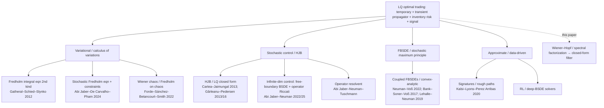

# Do we accurately represent existing solution methods? Are we missing some?

**Object under review:** `v2/optimal-trading-filters-v2.tex` — Smerlak, *Optimal Trading Filters: a Wiener–Hopf Approach*. The paper solves the linear-quadratic optimal-trading problem (temporary + transient/propagator impact + inventory risk, with a predictive signal) by a causal Wiener–Hopf factorization, and claims to *recover* the classical portfolio/execution rules as special cases (§5) while characterizing prior methods in §1.4 and the abstract.

**Scope of this review:** literature accuracy — whether the paper's description and recovery of existing solution methods is correct and complete. Not a novelty/correctness audit of the paper's own results.

---

## Summary Assessment

The paper's **broad** characterization of the prior art is accurate. Its abstract states that "existing treatments characterize the optimal policy implicitly, as the solution of an integral equation or an equivalent forward–backward system" — and that is exactly right for the analytical LQ–propagator–signal literature, which splits cleanly into (i) variational → Fredholm integral equation, (ii) stochastic control / HJB / Riccati, and (iii) FBSDE / stochastic maximum principle. All of the paper's specific method attributions check out **except one**, and there are **three to four notable omissions**, one of them close enough to the paper's own §4 to matter.

Three findings:

1. **One inaccurate attribution (§1.4).** The paper says Abi Jaber–Neuman's "optimal rate is the unique solution of a linear stochastic **Volterra** equation of the second kind." AJN's own abstract characterizes their solution as a "free-boundary $L^2$-valued **backward stochastic differential equation** and an **operator-valued Riccati equation**" [AJN]. The *propagator* is "Volterra-type"; the *equation* the control solves (in the variational form of the same school) is a stochastic **Fredholm** equation, not Volterra [AJ–DC–Pham]. This should be corrected.

2. **One materially missing reference.** Abi Jaber, De Carvalho & Pham (Sep 2024), *Trading with propagators and constraints*, solves the general-propagator problem **with linear functional constraints via Lagrange multipliers and their conditional expectations**, as a stochastic Fredholm equation [AJ–DC–Pham]. This is the same constraint-via-multiplier device the paper introduces in §4 ($\alpha^{\rm eff}=\alpha+\sum_k\xi_k\psi_k$, terminal $x_T=0$, multipliers with vanishing optional projection). It is uncited and is the most directly parallel prior work we identified for §4.

3. **Two–three further omissions of degree.** Cartea–Jaimungal (2013), credited elsewhere as "among the first" to embed a Markovian signal in execution, is uncited despite being the root of the signal-adaptive lineage the paper builds on. Signature/rough-path methods and the economics frequency-domain-LQ / Wiener–Hopf tradition (Hansen–Sargent, Whiteman) are alternative solution paradigms the paper does not situate itself against; these are arguably out of the closed-form/stationary scope but deserve a boundary sentence — the frequency-domain-LQ precedent especially, since it is a methodological precedent for the paper's own approach.

**Bottom line:** representation is mostly accurate; fix the AJN attribution, add the Abi Jaber–De Carvalho–Pham and Cartea–Jaimungal citations, and add one or two boundary sentences for signature/frequency-domain-LQ methods.

---

## The solution-method landscape

For the LQ problem with transient (propagator) impact and a predictive signal, the literature uses a small number of solution routes. All ultimately invert the same friction operator; they differ in how they represent that inverse.

| Method family | Representative work(s) | Solution object | Paper's coverage |
|---|---|---|---|
| Variational → Fredholm 2nd kind | Gatheral–Schied–Slynko 2012 | Fredholm integral equation | Cited & recovered (§5.2 liquidation) — accurate |
| Variational → stochastic Fredholm + constraints | Abi Jaber–De Carvalho–Pham 2024 | stochastic Fredholm eqn; multipliers | **Not cited** — parallels §4 |
| Wiener chaos | Forde et al. 2022 | Fredholm on Wiener chaos | Cited & recovered (§5.2) — consistent (not independently sourced) |
| HJB / LQ (DP) | Cartea–Jaimungal 2013; Gârleanu–Pedersen 2013/16 | value function / aim portfolio | GP cited & recovered (§5.1); **Cartea–Jaimungal not cited** |
| Infinite-dim control → BSDE + operator Riccati | Abi Jaber–Neuman 2022/25 | free-boundary L²-BSDE + operator Riccati | Cited but **mischaracterized** as "stochastic Volterra eqn 2nd kind" (§1.4) |
| FBSDE / convex-analytic | Neuman–Voß 2022; Bank–Soner–Voß 2017; Lehalle–Neuman 2019 | coupled FBSDEs | Cited & recovered (§5.1 NV) — accurate |
| Operator resolvent | Abi Jaber–Neuman–Tuschmann | operator resolvents | Cited as "operator-resolvent methods" — accurate |
| Wiener–Hopf / spectral factorization | *this paper*; econ: Hansen–Sargent, Whiteman | causal factor + projection → filter | The paper's method; econ precedent not situated |
| Signatures / RL | Kalsi–Lyons–Perez Arribas 2020; deep-BSDE | linear functional on signature / learned policy | Not mentioned |

---

## What the paper represents accurately (consensus)

*(The §5.1/§5.2 "recovered as … case" statements below are verified against the object paper's own text `v2/optimal-trading-filters-v2.tex`, not the external literature.)*

- **Gatheral–Schied–Slynko** as a deterministic Fredholm-integral-equation solution: correct. GSS obtain "a Fredholm integral equation of the second kind" from "a non-classical result on calculus of variations" [GSS-SSRN; OET-SSRN]. The paper recovers their U-shaped power-law liquidation profile in §5.2.
- **Gârleanu–Pedersen** as an LQ closed-form aim portfolio: correct. GP derive "a closed-form optimal dynamic portfolio policy … an 'aim portfolio'" [GP]. Recovered in §5.1 as the one-average case.
- **Neuman–Voß / Bank–Soner–Voß / Lehalle–Neuman** as FBSDE / signal-adaptive solutions: correct. NV solve "a system of four coupled forward-backward SDEs" by "a probabilistic and convex analytic approach" [NV]. Recovered in §5.1 as the two-average case.
- **Abi Jaber–Neuman–Tuschmann** as operator-resolvent: correct. They "solve the maximization problem explicitly in terms of operator resolvents" [AJNT].
- **The abstract's umbrella statement** — "an integral equation or an equivalent forward–backward system" — is an accurate two-family summary of the analytical literature.

---

## Accuracy issue

### AI-1 (should fix): AJN is not a "stochastic Volterra equation of the second kind"

§1.4 states: *"Their optimal rate is the unique solution of a linear stochastic Volterra equation of the second kind, with existence and uniqueness for any Volterra propagator and any adapted signal."*

Abi Jaber–Neuman's abstract instead characterizes the solution as *"a free-boundary $L^2$-valued backward stochastic differential equation and an operator-valued Riccati equation"* [AJN]. Two corrections:

- **Which representation is AJN's.** AJN's stated object is a *"free-boundary $L^2$-valued backward stochastic differential equation and an operator-valued Riccati equation"* [AJN] — an infinite-dimensional control characterization, not a single Volterra integral equation. If a one-equation description of this school is wanted, the *variational* form is a **stochastic Fredholm** equation, and it is Abi Jaber–De Carvalho–Pham 2024 who state it that way [AJ–DC–Pham]; attributing that Fredholm form specifically to AJN conflates two papers of the same group.
- **Volterra vs Fredholm (a naming caveat, not a clean swap).** AJN call the *propagator* "Volterra-type" (causal impact); the paper appears to have transferred "Volterra" to the *equation*. For the *deterministic* liquidation cost the first-order condition is a symmetric-kernel **Fredholm** equation (essentially GSS's result); the *stochastic, adapted-signal* object carries conditional-expectation / forward–backward structure, so "Fredholm not Volterra" is a caveat about naming rather than a mechanical substitution.

This matters because the paper's contrast ("existing methods give an implicit equation; we give a closed-form factorization") rests on correctly naming that equation. The paper's current *abstract* wording ("integral equation or forward–backward system") is already correct — only §1.4's specific AJN attribution needs revising.

---

## Missing references / methods

### MR-1 (materially missing): Abi Jaber, De Carvalho & Pham (2024), *Trading with propagators and constraints*

[arXiv:2409.12098, Sep 2024]. This solves the general-propagator optimal-trading problem **under linear functional inequality constraints**, with "the optimal control … given explicitly in terms of the corresponding **Lagrange multipliers and their conditional expectations**, as a solution to a linear stochastic Fredholm equation" [AJ–DC–Pham]. Constraint examples include no-shorting, no-buying, and a stochastic stop-trading barrier.

This is the most directly parallel prior work we identified for the paper's §4, which handles position and terminal-inventory constraints by exactly this device: $\alpha^{\rm eff}=\alpha+\sum_k\xi_k\psi_k$ with multipliers $\xi_k$ (and a process-valued multiplier for $x_T=0$) whose optional projection vanishes. The paper's novelty over AJ–DC–Pham is the *closed-form* factorization (they solve the Fredholm system numerically via a stochastic Uzawa / least-squares-Monte-Carlo scheme), so this is a citation-and-positioning gap, not a priority dispute — but it should be cited in §1.4/§4. (A single, unrefereed Politecnico di Milano master's thesis subsequently flags an existence-proof gap in AJ et al. 2024 [Politesi] — single-source, worth a glance but not central here.)

### MR-2 (should add): Cartea & Jaimungal (signal-in-execution)

Neuman–Voß credit Cartea & Jaimungal as "among the first … to account for a Markovian signal in an optimal execution problem in the presence of linear temporary and permanent price impact of Almgren and Chriss type" [NV]; Lehalle–Neuman cite the framework as *Modeling Asset Prices for Algorithmic and High Frequency Trading*, Appl. Math. Finance 20(6):512–547 (2013) [LN]. (Cartea–Jaimungal also have a closer execution paper, *Incorporating Order-Flow into Optimal Execution*, 2016.) The paper's signal-adaptive discussion (LN/NV/BSV) descends from this line, yet no Cartea–Jaimungal paper is cited. Their impact model is Almgren–Chriss (temporary + permanent), simpler than the propagator, but they originate "signal in execution via stochastic control." *(Single interpretive source for the "among the first" framing: NV/LN; the exact Cartea–Jaimungal reference to add — 2013 framework vs 2016 order-flow — should be confirmed against NV's bibliography.)*

### MR-3 (boundary sentence): signature / rough-path and RL methods

Signature methods — Kalsi–Lyons–Perez Arribas (2020) [Sig-1] and "Signature Trading" [Sig-2] — represent the strategy as a linear functional on the path signature, a genuinely different solution paradigm for execution with path-dependent signals; RL / deep-BSDE solvers are the numerical counterpart. These are outside the paper's closed-form/stationary scope, but a one-sentence boundary statement ("we treat the linear-quadratic stationary case analytically; path-dependent and data-driven approaches … are complementary") would forestall the reviewer question.

### MR-4 (positioning): frequency-domain LQ / Wiener–Hopf in economics

Using Wiener–Hopf/spectral factorization to solve LQ dynamic optimization in the frequency domain is established in economics — Hansen–Sargent frequency-domain methods and Whiteman's "Spectral utility, Wiener-Hopf techniques, and rational expectations" [SpecUtil], which "utilizes Wiener-Hopf methods to maximize the frequency-domain representation of the objective … handles moving average errors." The paper traces its Wiener–Hopf lineage through Wiener–Hopf 1931 → Gohberg–Krein → Arveson (the operator-factorization side) but not through this control/economics frequency-domain-LQ side, a methodological precedent (single catalog source [SpecUtil] plus our inference). Acknowledging it would strengthen, not weaken, the novelty claim (the new element is the *propagator/execution* application and the fractional-impact closed forms, not frequency-domain LQ per se). Our search did not surface a prior optimal-*execution* paper using Wiener–Hopf factorization for the trading policy itself; this was not an exhaustive novelty search and, per this review's scope (literature accuracy, not a novelty audit), it is a search note, not a novelty endorsement.

---

## Disagreements / uncertainty

- **AJN's exact equation wording** rests on AJN's abstract (v2, Sep 2025) plus the sibling AJ–DC–Pham paper; I did not extract the precise theorem statement from AJN's body (a direct paper-Q&A call failed once). The direction is well supported (BSDE + operator Riccati is AJN's stated object; "Volterra equation" is not), but the exact phrasing to substitute should be checked against AJN's Theorem statement before editing. Marked as the one single-source-sensitive point.
- **Cartea–Jaimungal necessity** is a judgment call: their model is not a propagator model, so a purist could argue it is out of scope. The counter is that the paper already cites the Almgren–Chriss temporary+permanent lineage (Almgren–Chriss, Obizhaeva–Wang) and the signal-adaptive lineage (LN/NV/BSV), so the originator of their intersection is a natural inclusion.

---

## Recommendations (concrete)

1. **§1.4:** replace "linear stochastic Volterra equation of the second kind" with AJN's actual object — a free-boundary $L^2$-BSDE plus operator-valued Riccati equation; if a single-equation phrasing is preferred, use "stochastic **Fredholm** equation" and attribute it to Abi Jaber–De Carvalho–Pham (not AJN). [AI-1]
2. **§1.4 / §4:** cite Abi Jaber–De Carvalho–Pham 2024 as the prior constraint-via-multiplier / stochastic-Fredholm treatment; state the paper's delta (closed-form factorization vs numerical Uzawa/LSMC). [MR-1]
3. **§1.4:** add Cartea–Jaimungal 2013 as the origin of signal-adaptive stochastic-control execution. [MR-2]
4. **§1.4 or conclusion:** one boundary sentence placing signature/RL methods as complementary; optionally acknowledge the Hansen–Sargent/Whiteman frequency-domain-LQ Wiener–Hopf precedent. [MR-3, MR-4]

None of these threaten the paper's contribution (a closed-form Wiener–Hopf filter and its fractional-impact consequences); they tighten the "relation to prior work" and remove one factual slip.

---

## Sources

- Gatheral–Schied–Slynko, *Transient Linear Price Impact and Fredholm Integral Equations*, Math. Finance 22:445 (2012): https://papers.ssrn.com/sol3/papers.cfm?abstract_id=1531466 ; https://doi.org/10.1111/j.1467-9965.2011.00478.x
- *Optimal Execution with Transient Impact* (Fredholm 2nd kind): https://papers.ssrn.com/sol3/papers.cfm?abstract_id=2183685
- Gârleanu–Pedersen, *Dynamic Trading with Predictable Returns and Transaction Costs*, J. Finance: https://doi.org/10.1111/jofi.12080
- Neuman–Voß, *Optimal Signal-Adaptive Trading with Temporary and Transient Price Impact* [2002.09549]: https://arxiv.org/abs/2002.09549
- Lehalle–Neuman, *Incorporating Signals into Optimal Trading* [1704.00847]: https://ar5iv.labs.arxiv.org/html/1704.00847 ; https://link.springer.com/content/pdf/10.1007/s00780-019-00382-7.pdf
- Abi Jaber–Neuman, *Optimal Liquidation with Signals: the General Propagator Case* [2211.00447 v2]: https://arxiv.org/abs/2211.00447
- Abi Jaber–Neuman–Tuschmann, *Optimal Portfolio Choice with Cross-Impact Propagators*: https://doi.org/10.1111/mafi.70025 ; https://doi.org/10.2139/ssrn.4759758
- **Abi Jaber–De Carvalho–Pham, *Trading with Propagators and Constraints* [2409.12098]:** https://arxiv.org/abs/2409.12098
- *Fredholm Approach to Nonlinear Propagator Models* [2503.04323]: https://arxiv.org/html/2503.04323
- Kalsi–Lyons–Perez Arribas, *Optimal Execution with Rough Path Signatures* [1905.00728]: https://arxiv.org/pdf/1905.00728
- *Signature Trading* [2308.15135]: https://ar5iv.labs.arxiv.org/html/2308.15135
- Whiteman, *Spectral utility, Wiener-Hopf techniques, and rational expectations* (MaRDI): https://portal.mardi4nfdi.de/wiki/Item:Q1109666
- *Optimal Execution: A Review* (survey): https://portal.mardi4nfdi.de/wiki/Optimal_Execution:_A_Review
- Politecnico di Milano thesis flagging an existence-proof gap in Abi Jaber et al. 2024: https://www.politesi.polimi.it/retrieve/fdda7e71-eb23-407c-8701-ba300c16f73d/tesi_formato.pdf

*Evidence log:* `notes/execution-solution-methods-publications.md`. *Plan:* `outputs/.plans/execution-solution-methods.md`.
